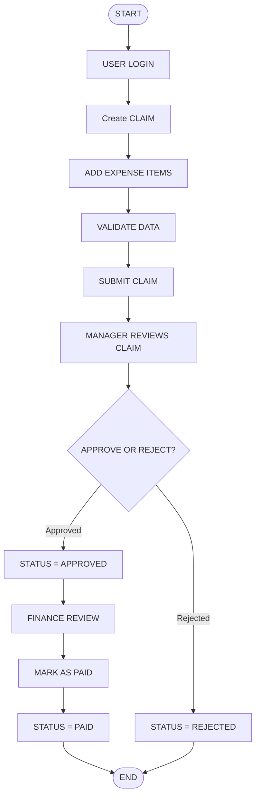

# CLAIMX – Expense Claim Management System
## High-Level Design (HLD)

---

## Table of Contents

1. [Introduction](#1-introduction)
2. [Product Requirements](#2-product-requirements)
3. [High-Level Workflow](#3-high-level-workflow)
4. [Core Modules](#4-core-modules)
5. [Conclusion](#5-conclusion)

---

## 1. Introduction

CLAIMX is an internal enterprise expense claim management system designed to streamline the submission, approval, and payment of employee expense claims.
The system provides a structured workflow that enables employees to submit claims, managers to review and approve them, finance teams to process payments, and administrators to manage system operations.
CLAIMX ensures controlled state transitions, role-based access control, and audit traceability to maintain accountability and transparency within the organization.

---

## 2. Product Requirements

CLAIMX must allow employees to create, edit, and submit expense claims within a controlled workflow.
Managers are responsible for reviewing submitted claims and either approving or rejecting them based on organizational policies.
Finance personnel must be able to process approved claims and mark them as paid.
Administrators are responsible for managing users and monitoring system activity.

The system must ensure secure authentication, enforce role-based access control, and maintain an audit trail for all claim state transitions.
All workflow changes must be handled transactionally to ensure data consistency and integrity.

---

## 3. High-Level Workflow

---

## 4. Core Modules

### 4.1 Authentication Module
Handles user login and access control. Ensures only authorized users can access the system based on their assigned roles.

### 4.2 Claim Management Module
Allows employees to create, edit, submit, and track expense claims throughout their lifecycle.

### 4.3 Manager Approval Module
Enables reporting managers to review submitted claims and either approve or reject them according to organizational policy.

### 4.4 Finance Processing Module
Allows finance personnel to review approved claims and mark them as paid after verification.

### 4.5 Administration & Audit Module
Provides administrative capabilities such as user management and ensures all claim state changes are recorded for traceability.

---

## 5. Conclusion

CLAIMX is a structured and secure expense claim management system designed for internal enterprise use.
It streamlines the claim submission and approval process while ensuring accountability through role-based access control and audit traceability.
The system provides a clear workflow, controlled state transitions, and a scalable foundation for future enhancements.