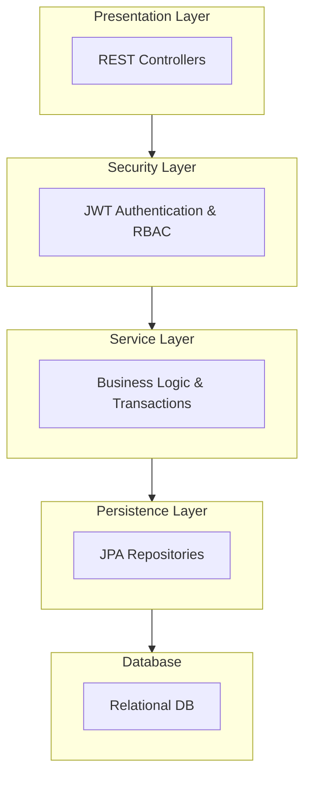
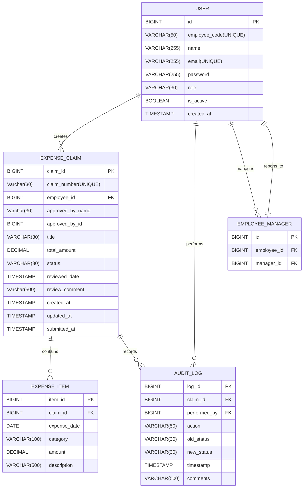
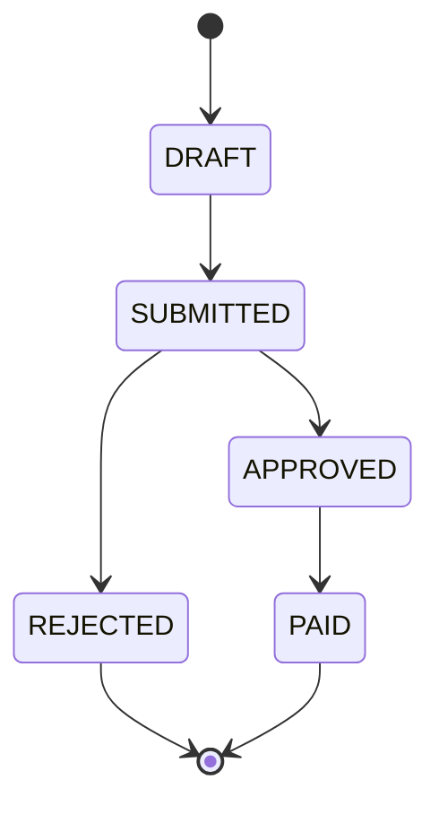
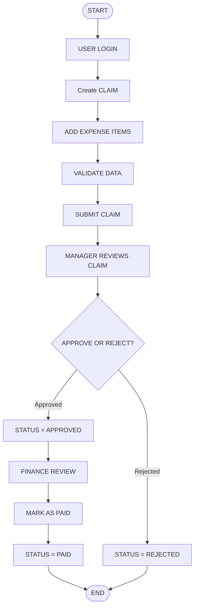

# CLAIMX – Expense Claim Management System
## Low-Level Design (LLD)
- [CLAIMX – Expense Claim Management System](#claimx--expense-claim-management-system)
    - [Low-Level Design (LLD)](#low-level-design-lld)
    - [1. Introduction](#1-introduction)
    - [2. System Architecture](#2-system-architecture)
        - [2.1 Architecture Overview](#21-architecture-overview)
        - [2.2 Layered Architecture Diagram](#22-layered-architecture-diagram)
        - [2.3 Package Structure](#23-package-structure)
            - [Base Package](#base-package)
            - [Package Hierarchy](#package-hierarchy)
    - [3. Database Design](#3-database-design)
        - [3.1 Database Overview](#31-database-overview)
        - [3.2 Entity Relationships](#32-entity-relationships)
        - [3.3 ER Diagram](#33-er-diagram)
        - [Foreign Key Constraints \& References](#foreign-key-constraints--references)
        - [3.4 Status, Role, ExpenseCatagory Enumerations](#34-status-role-expensecatagory-enumerations)
            - [Claim Status Values](#claim-status-values)
            - [Valid Claim Status Transitions](#valid-claim-status-transitions)
            - [Catagory values](#catagory-values)
            - [User Role Values](#user-role-values)
            - [Audit Actions](#audit-actions)
    - [4. Business Rules](#4-business-rules)
        - [4.1 User Role Rules](#41-user-role-rules)
            - [4.1.1 EMPLOYEE](#411-employee)
            - [4.1.2 MANAGER](#412-manager)
            - [4.1.3 FINANCE](#413-finance)
            - [4.1.4 ADMIN](#414-admin)
        - [4.2 Claim Creation Rules](#42-claim-creation-rules)
        - [4.3 Claim Editing Rules](#43-claim-editing-rules)
        - [4.4 Claim Submission Rules](#44-claim-submission-rules)
        - [4.5 Claim Approval Rules](#45-claim-approval-rules)
        - [4.6 Payment Rules](#46-payment-rules)
        - [4.7 Status Transition Rules](#47-status-transition-rules)
        - [4.8 Audit Logging Rules](#48-audit-logging-rules)
    - [5. Workflow](#5-workflow)
    - [6. API Design](#6-api-design)
        - [6.1 Authentication APIs](#61-authentication-apis)
            - [6.1.1 Login](#611-login)
        - [6.2 Employee APIs (Claim Owner)](#62-employee-apis-claim-owner)
            - [6.2.1 Create Claim (Draft)](#621-create-claim-draft)
            - [6.2.2 Update Claim (Only DRAFT)](#622-update-claim-only-draft)
            - [6.2.3 Add Expense Item](#623-add-expense-item)
            - [6.2.4 Update Expense Item](#624-update-expense-item)
            - [6.2.5 Delete Expense Item](#625-delete-expense-item)
            - [6.2.6 Submit Claim](#626-submit-claim)
            - [6.2.7 View My Claims](#627-view-my-claims)
            - [6.2.8 View Claim By Id](#628-view-claim-by-id)
            - [6.2.9 Delete Claim (Only DRAFT)](#629-delete-claim-only-draft)
            - [6.2.10 View My Claims by Status](#6210-view-my-claims-by-status)
            - [6.2.11 Add multipleItems](#6211-add-multipleitems)
        - [6.3 Manager APIs (Approver)](#63-manager-apis-approver)
            - [6.3.1 Get Pending Claims](#631-get-pending-claims)
            - [6.3.2 Get Pending Claims](#632-get-pending-claims)
            - [6.3.3 Approve Claim](#633-approve-claim)
            - [6.3.4 Reject Claim](#634-reject-claim)
        - [6.4 Admin APIs](#64-admin-apis)
            - [6.4.1 Get All Users](#641-get-all-users)
            - [6.4.2 View All Claims](#642-view-all-claims)
            - [6.4.3 View Audit Logs](#643-view-audit-logs)
            - [6.4.4 View User by userId](#644-view-user-by-userid)
        - [6.5 Finance APIs (Payment Authority)](#65-finance-apis-payment-authority)
            - [6.5.1 Get Approved Claims (Pending Payment)](#651-get-approved-claims-pending-payment)
            - [6.5.2 Mark Claim as Paid](#652-mark-claim-as-paid)
            - [6.5.3 View Paid Claims](#653-view-paid-claims)
    - [7. Validation \& Exception Handling](#7-validation--exception-handling)
        - [7.1 Validation Strategy](#71-validation-strategy)
        - [7.2 State Validation](#72-state-validation)
        - [7.3 Authorization Validation](#73-authorization-validation)
        - [7.4 Exception Handling Strategy](#74-exception-handling-strategy)
        - [7.5 Database Transaction Handling](#75-database-transaction-handling)
        - [7.6 Logging of Exceptions](#76-logging-of-exceptions)
    - [8. Security Design](#8-security-design)
        - [8.1 Security Architecture Overview](#81-security-architecture-overview)
        - [8.2 Authentication Mechanism (JWT-Based)](#82-authentication-mechanism-jwt-based)
            - [Login Flow](#login-flow)
            - [JWT Token Properties](#jwt-token-properties)
        - [8.3 Authorization (Role-Based Access Control)](#83-authorization-role-based-access-control)
            - [Defined Roles](#defined-roles)
            - [Enforcement Levels](#enforcement-levels)
        - [8.4 Password Security](#84-password-security)
        - [8.5 Token Security \& Secret Management](#85-token-security--secret-management)
        - [8.6 Protection Against Common Attacks](#86-protection-against-common-attacks)
        - [8.7 Input Validation \& Data Protection](#87-input-validation--data-protection)
        - [8.8 Audit Log Security](#88-audit-log-security)
        - [8.9 Transactional Security Enforcement](#89-transactional-security-enforcement)
        - [8.11 Security Summary](#811-security-summary)
    - [9. Performance \& Scalability Considerations](#9-performance--scalability-considerations)
        - [9.1 Database Optimization](#91-database-optimization)
        - [9.2 Pagination Strategy](#92-pagination-strategy)
        - [9.3 Transaction Optimization](#93-transaction-optimization)
        - [9.4 Connection Management](#94-connection-management)
        - [9.5 Logging and Observability Considerations](#95-logging-and-observability-considerations)
    - [10. Transaction Management Strategy](#10-transaction-management-strategy)
        - [10.1 Transaction Overview](#101-transaction-overview)
        - [10.2 Transactional Operations](#102-transactional-operations)
        - [10.3 Rollback Rules](#103-rollback-rules)
        - [10.4 Isolation and Concurrency](#104-isolation-and-concurrency)
        - [10.5 Read-Only Transactions](#105-read-only-transactions)
        - [10.6 Consistency Guarantees](#106-consistency-guarantees)
    - [11. Unit Testing Requirements](#11-unit-testing-requirements)
        - [11.1 Testing Strategy](#111-testing-strategy)
        - [11.2 Required Test Coverage](#112-required-test-coverage)
        - [11.3 Test Scenarios to Cover](#113-test-scenarios-to-cover)
        - [11.4 Key Testing Concepts](#114-key-testing-concepts)
    - [12. Integration Testing with Testcontainers](#12-integration-testing-with-testcontainers)
        - [12.1 Testcontainers](#121-testcontainers)
        - [12.2 Integration Test Scenarios](#122-integration-test-scenarios)
        - [12.4 What to Validate](#124-what-to-validate)
    - [13. Deployment \& Environment Configuration](#13-deployment--environment-configuration)
        - [13.1 Deployment Overview](#131-deployment-overview)
        - [13.2 Environment Configuration](#132-environment-configuration)
        - [13.3 Database Setup](#133-database-setup)
        - [13.4 Initial Admin Seeding](#134-initial-admin-seeding)
    - [14. Assumptions, Limitations and Future Enhancements](#14-assumptions-limitations-and-future-enhancements)
        - [14.1 Assumptions](#141-assumptions)
        - [14.2 Limitations](#142-limitations)
        - [14.3 Future Enhancements](#143-future-enhancements)
    - [The system can be extended to support multi-stage approvals, receipt attachment management, notification services, reporting dashboards, reimbursement tracking, expanded role hierarchies, and integration with payroll or HRMS platforms to enhance enterprise readiness.](#the-system-can-be-extended-to-support-multi-stage-approvals-receipt-attachment-management-notification-services-reporting-dashboards-reimbursement-tracking-expanded-role-hierarchies-and-integration-with-payroll-or-hrms-platforms-to-enhance-enterprise-readiness)
    - [15. Conclusion](#15-conclusion)

## 1. Introduction

This document defines the detailed technical design of the CLAIMX – Expense Claim Management System.
It describes the internal architecture, database structure, API specifications, service responsibilities, validation rules, security mechanisms, and transaction management strategy required for implementation.
This document builds upon the High-Level Design (HLD) and focuses on implementation-level components, including class structure, module boundaries, state management, and data persistence design.

The Technology Stack used are  Java 17, Spring Boot 3.x, PostgreSQL, Gradle, JWT

---

## 2. System Architecture

### 2.1 Architecture Overview

CLAIMX follows a strict layered architecture pattern to ensure separation of concerns, maintainability, and scalability. Each layer has a well-defined responsibility and interacts only with the layer directly below it.

The architecture enforces clear boundaries between request handling, business logic, data access, and database storage. This design improves testability, modularity, and future extensibility of the system.

The system is divided into the following logical layers:

- **Presentation Layer** – Exposes REST APIs and handles HTTP communication.
- **Service Layer** – Implements business rules and manages claim workflow transitions.
- **Persistence Layer** – Performs database operations using JPA repositories.
- **Database Layer** – Stores structured relational data.
- **Security Layer** – Handles authentication and role-based authorization.

---

### 2.2 Layered Architecture Diagram


### 2.3 Package Structure

The CLAIMX project follows a modular package structure aligned with the layered architecture.
Each package is designed to enforce separation of concerns and maintain maintainability and scalability.

#### Base Package

com.company.claimx

---
#### Package Hierarchy
```text
com.company.claimx
│
├── annotation
│   ├── Authenticated
│
├── aspect
│   ├── AuthenticationAspect
│
├── config
│   ├── SecurityConfig
│   ├── JwtAuthenticationFilter
│   ├── JwtUtil
│   ├── CustomUserDetailsService
│   ├── DataSeeder
│
├── constants
│   ├── ErrorMessagesConstants
│   ├── MessageResponseConstants
│
├── controller
│   ├── AuthController
│   ├── ClaimController
│   ├── ManagerController
│   ├── FinanceController
│   ├── AdminController
│
├── service
│   ├── AuthService
│   ├── ClaimService
│   ├── ManagerApprovalService
│   ├── FinanceService
│   ├── AdminService
│   ├── AuditService
│   ├── ManagerLookupService
│
├── repository
│   ├── UserRepository
│   ├── ExpenseClaimRepository
│   ├── ExpenseItemRepository
│   ├── AuditLogRepository
│
├── entity
│   ├── AuditActions
│   ├── User
│   ├── ExpenseClaim
│   ├── ExpenseItem
│   ├── AuditLog
│
├── dto
│   ├── LoginRequest
│   ├── LoginResponse
│   ├── CreateClaimRequest 
│   ├── UpdateClaimRequest
│   ├── ClaimResponse
│   ├── AddExpenseItemRequest
│   ├── ExpenseItemResponse
│
├── exception
│   ├── GlobalExceptionHandler
│   ├── UserNotFoundException
│   ├── UserInactiveException
│   ├── InvalidStateException
│   ├── UnauthorizedActionException
│
├── enum
│   ├── AuditActions
│   ├── Category
│   ├── ClaimStatus
│   ├── UserRole
│
├── mapper
│   ├── ClaimMapper
│
│
└── ClaimxApplication
```

---

## 3. Database Design

### 3.1 Database Overview

The CLAIMX system uses a relational database (PostgreSQL) to store transactional and workflow-related data. The database design follows normalization principles to eliminate redundancy and maintain data integrity.The system is fully transactional and adheres to ACID properties to ensure reliable claim processing, approval workflows, and audit tracking.


### 3.2 Entity Relationships

The CLAIMX database schema is designed using well-defined relational mappings to maintain referential integrity and enforce workflow ownership constraints.

The relationships between entities are as follows:

1. **User → ExpenseClaim (1:N)**
    - One user (employee) can create multiple expense claims.
    - Each expense claim belongs to exactly one user.

2. **ExpenseClaim → ExpenseItem (1:N)**
    - One claim can contain multiple expense items.
    - Each expense item is associated with exactly one claim.
    - Cascade delete is enabled to remove expense items when a claim is deleted.

3. **ExpenseClaim → AuditLog (1:N)**
    - Each claim can have multiple audit log records.
    - Every state transition generates one audit entry.

4. **User → AuditLog (1:N)**
    - One user can perform multiple actions recorded in the audit log.
    - Each audit record is linked to exactly one performing user.

5. **User → EmployeeManager (1:N)**
    - One manager can manage multiple employees.
    - Each employee has exactly one assigned manager.

All foreign key relationships enforce referential integrity at the database level.

---


### 3.3 ER Diagram



### Foreign Key Constraints & References

The following foreign key relationships enforce referential integrity at the database level:

1. EMPLOYEE_MANAGER.employee_id → USER.id  
   (Each employee references a valid user record)

2. EMPLOYEE_MANAGER.manager_id → USER.id  
   (Each manager must exist as a user with role = MANAGER)

3. EXPENSE_CLAIM.user_id → USER.id  
   (Each claim belongs to a valid user)

4. EXPENSE_ITEM.claim_id → EXPENSE_CLAIM.claim_id  
   (Each expense item belongs to a valid claim)

5. AUDIT_LOG.claim_id → EXPENSE_CLAIM.claim_id  
   (Each audit record is tied to a specific claim)

6. AUDIT_LOG.performed_by → USER.id  
   (Each audit action is performed by a valid user)

All foreign keys use ON DELETE RESTRICT unless otherwise specified.
EXPENSE_ITEM uses ON DELETE CASCADE when its parent EXPENSE_CLAIM is deleted.

---

### 3.4 Status, Role, ExpenseCatagory Enumerations

Although `status` , `role` and `catagory` are stored as `VARCHAR` in the database for flexibility, their values are strictly restricted through application-level validation or database CHECK constraints.

#### Claim Status Values
- DRAFT
- SUBMITTED
- APPROVED
- REJECTED
- PAID


#### Valid Claim Status Transitions
- DRAFT → SUBMITTED
- SUBMITTED → APPROVED
- SUBMITTED → REJECTED
- APPROVED → PAID

#### Catagory values
- TRAVEL
- ACCOMMODATION
- FOOD
- OFFICE_SUPPLIES
- COMMUNICATION
- OTHER

#### User Role Values
- EMPLOYEE
- MANAGER
- FINANCE
- ADMIN

#### Audit Actions
- CLAIM_CREATED
- CLAIM_SUBMITTED
- CLAIM_APPROVED
- CLAIM_REJECTED
- CLAIM_PAID

catagory includes things such as TRAVEL ( Flights, trains, taxis) , ACCOMMODATION - (Hotels), FOOD (Meals, client dinners), OFFICE_SUPPLIES (Stationery, equipment), COMMUNICATION(Phone, internet), OTHER (Miscellaneous)

---
## 4. Business Rules

This section defines the operational and behavioral rules governing CLAIMX, including role permissions, claim lifecycle constraints, validation logic, and audit enforcement.

### 4.1 User Role Rules

#### 4.1.1 EMPLOYEE
Can create expense claims, can edit claims only when status = DRAFT, can delete claims only when status = DRAFT, can submit claims, can view only their own claims, cannot approve or reject claims.

#### 4.1.2 MANAGER
Can create expense claims, can view claims of employees reporting to them, can approve claims with status = SUBMITTED, can reject claims with status = SUBMITTED, cannot modify expense items after submission, cannot approve or reject their own claim.

#### 4.1.3 FINANCE
Can view claims with status = APPROVED, can mark claims as PAID, cannot approve or reject claims and cannot modify expense items.

#### 4.1.4 ADMIN
Can manage users, can view all claimsand cannot modify financial records after approval.

---

### 4.2 Claim Creation Rules
Only users with role = EMPLOYEE or MANAGER can create claims.
A newly created claim must have status = DRAFT.
total_amount must equal the sum of all associated ExpenseItem amounts.
expense_date cannot be in the future.
Claim creator must be stored in ExpenseClaim.employee_id.

---

### 4.3 Claim Editing Rules
Claims can only be edited when status = DRAFT.
Expense items can only be added, modified, or deleted while claim is in DRAFT.
Once submitted, expense items cannot be modified.

---

### 4.4 Claim Submission Rules
Claim must be in DRAFT state.
Claim must contain at least one ExpenseItem.
total_amount must be validated before submission.
On submission: status changes from DRAFT → SUBMITTED, submitted_at timestamp is recorded, AuditLog entry must be created

---

### 4.5 Claim Approval Rules
Claim must be in SUBMITTED state.
Only the assigned reporting manager (from EmployeeManager table) can approve or reject.
A user cannot approve their own claim.
On approval: status changes from SUBMITTED → APPROVED, AuditLog entry must be created
On rejection: status changes from SUBMITTED → REJECTED, Manager must provide comments, AuditLog entry must be created

---

### 4.6 Payment Rules
Only users with role = FINANCE can mark claims as PAID.
Claim must be in APPROVED state.
On payment: status changes from APPROVED → PAID, AuditLog entry must be created

---

### 4.7 Status Transition Rules

Allowed transitions:
- DRAFT → SUBMITTED
- SUBMITTED → APPROVED
- SUBMITTED → REJECTED
- APPROVED → PAID

Not allowed:
- DRAFT → APPROVED
- DRAFT → REJECTED
- REJECTED → Any state
- PAID → Any state

REJECTED and PAID are final states.  
Invalid transitions must throw a validation error.

---

### 4.8 Audit Logging Rules
An AuditLog entry must be created for: Claim submission, Approval, Rejection, Payment, Any status change

Each log must store: claim_id, old_status, new_status, performed_by, timestamp, comments (if applicable)

---
## 5. Workflow

The state transition diagram defines the strict lifecycle rules governing claim status changes. A claim always starts in the DRAFT state. From DRAFT, it can only move to SUBMITTED. Once submitted, the manager can either APPROVE or REJECT the claim. If approved, the claim transitions to APPROVED and can then move to PAID when processed by Finance. REJECTED and PAID are final states, meaning no further transitions are allowed. The system enforces forward-only transitions and prevents invalid state movements such as DRAFT directly to APPROVED or any backward transitions. This controlled state machine ensures workflow integrity, prevents unauthorized changes, and maintains consistency within the system.

---

The workflow block diagram represents the complete operational lifecycle of an expense claim from creation to final settlement. The process begins when a user (EMPLOYEE or MANAGER) logs into the system and creates a new claim, which is initialized in the DRAFT state. The user adds expense items, and the system performs validations such as ensuring the expense date is not in the future, the amount is greater than zero, and the total amount equals the sum of all items. Once validated, the claim can be submitted, transitioning it to the SUBMITTED state. The claim is then reviewed by the assigned manager, who can either approve or reject it. If approved, it moves to the APPROVED state and becomes visible to the Finance team. Finance can then mark the claim as PAID, completing the lifecycle. If rejected, the claim transitions to the REJECTED state and the workflow terminates. Each state transition is recorded in the AuditLog for traceability.


---
## 6. API Design

### 6.1 Authentication APIs

#### 6.1.1 Login

**Endpoint**  
POST /api/auth/login

example:
**Request**
```json
{
  "email": "prasid@gmail.com",
  "password": "password"
}
```
**Response**
```json
{
  "token": "jwt_token",
  "role": "EMPLOYEE",
  "emp_id": "001"
}
```
Validations: Email must exist, Password must match (hashed comparison), Account must be active.

Security: JWT token returned on successful authentication, Token must be included in Authorization header for protected APIs, Passwords stored only in hashed format.

---

### 6.2 Employee APIs (Claim Owner)

#### 6.2.1 Create Claim (Draft)

**Endpoint**  
POST /api/claims

**Behavior**
Creates new claim, status = DRAFT, employee_id derived from JWT token, created_at timestamp set

---

#### 6.2.2 Update Claim (Only DRAFT)

**Endpoint**  
PUT /api/claims/{claimId}

---

#### 6.2.3 Add Expense Item

**Endpoint**  
POST /api/claims/{claimId}/items

**Validations**
Claim must be in DRAFT state, expense_date ≤ current date and amount > 0

---

#### 6.2.4 Update Expense Item

**Endpoint**  
PUT /api/claims/{claimId}/items/{itemId}

**Allowed If**
Claim status = DRAFT

---

#### 6.2.5 Delete Expense Item

**Endpoint**  
DELETE /api/claims/{claimId}/items/{itemId}

**Allowed If**
Claim status = DRAFT

---

#### 6.2.6 Submit Claim

**Endpoint**  
POST /api/claims/{claimId}/submit

**State Change**
DRAFT → SUBMITTED

**System Actions**
submitted_at timestamp set, AuditLog entry created

---

#### 6.2.7 View My Claims

**Endpoint**  
GET /api/claims/my

---

#### 6.2.8 View Claim By Id

**Endpoint**  
GET /api/claims/{claimId}

---

#### 6.2.9 Delete Claim (Only DRAFT)

**Endpoint**  
DELETE /api/claims/{claimId}

---

#### 6.2.10 View My Claims by Status

**Endpoint**  
GET /api/claims/status/{status}


---


#### 6.2.11 Add multipleItems

**Endpoint**  
GET /api/claims/{claimId}/items/multipleItems

---
### 6.3 Manager APIs (Approver)

#### 6.3.1 Get Pending Claims

**Endpoint**  
GET /api/manager/claims/pending

**Returns**
Claims where: employee_id reports to logged-in manager, status = SUBMITTED

---

#### 6.3.2 Get Pending Claims

**Endpoint**  
GET /api/manager/claims/pending/{claimId}

**Returns**
Claim where: employee_id reports to logged-in manager, status = SUBMITTED for the requested claimId

---

#### 6.3.3 Approve Claim

**Endpoint**  
POST /api/manager/claims/{claimId}/approve

**Validations**
Claim status must be SUBMITTED, Manager must be assigned reporting manager of employee, Manager cannot approve their own claim

**State Change**
SUBMITTED changes to  APPROVED and AuditLog is created

---

#### 6.3.4 Reject Claim

**Endpoint**  
POST /api/manager/claims/{claimId}/reject

**Validations**
Rejection comment is mandatory

**State Change**
SUBMITTED chages to  REJECTED and AuditLog entry created

---

### 6.4 Admin APIs


---

#### 6.4.1 Get All Users

**Endpoint**  
GET /api/admin/users

**Behavior**
Returns list of all users

---

#### 6.4.2 View All Claims

**Endpoint**  
GET /api/admin/claims

**Behavior**
Returns all the claims

---

#### 6.4.3 View Audit Logs

**Endpoint**  
GET /api/admin/audit-logs

**Behavior**
Returns all the logs.

---

#### 6.4.4 View User by userId

**Endpoint**  
GET /api/admin/users/{userId}

**Behavior**
Returns the user details with the claims

---


### 6.5 Finance APIs (Payment Authority)

Finance users are responsible for processing approved claims and marking them as paid. They cannot approve or reject claims.

---

#### 6.5.1 Get Approved Claims (Pending Payment)

**Endpoint**  
GET /api/finance/claims/approved

**Returns**
Claims where:
- status = APPROVED

**Access**
Role = FINANCE

---

#### 6.5.2 Mark Claim as Paid

**Endpoint**  
POST /api/finance/claims/{claimId}/pay

**Validations**
- Claim must be in APPROVED state
- Only users with role = FINANCE can perform this action

**State Change**
APPROVED → PAID

**System Actions**
- AuditLog entry created
- Payment timestamp recorded (if implemented)

---

#### 6.5.3 View Paid Claims

GET /api/finance/claims/paid

**System Actions**
- Allows finance to review completed payments.

---

## 7. Validation & Exception Handling

### 7.1 Validation Strategy

Validation is enforced at two layers to ensure both data integrity and business rule compliance.

**1. Input Validation (Controller Layer)**  
Required fields validation, Data type validation ,Length validation, Date format validation, Enum value validation, Numeric range validation
- If validation fails → return 400 Bad Request.

**2. Business Validation (Service Layer)**  
Enforces workflow rules and system constraints.  
Examples: Claim must have at least one expense item before submission, Manager cannot approve own claim, Only assigned manager can approve or reject
- If violated → return 409 Conflict or 400 Bad Request.

---

### 7.2 State Validation

Before every state transition, the system validates allowed movements according to workflow rules.

| From State | Allowed Action | To State |
|------------|---------------|----------|
| DRAFT | Submit | SUBMITTED |
| SUBMITTED | Approve | APPROVED |
| SUBMITTED | Reject | REJECTED |

- Any invalid transition → return 409 Conflict.

---

### 7.3 Authorization Validation

Role-based access control is enforced via middleware. EMPLOYEE → Manage own claims only, MANAGER → Approve/reject assigned team claims only, ADMIN → User management and system-wide access
- If unauthorized → return 403 Forbidden.

---

### 7.4 Exception Handling Strategy

The system uses centralized exception handling to standardize API responses.
Custom Exceptions: ValidationException, UnauthorizedException, ResourceNotFoundException, InvalidStateException, BusinessRuleViolationException

---

### 7.5 Database Transaction Handling

Critical operations such as Submit, Approve, Reject, and Delete are executed within database transactions. Begin transaction, Perform validations and updates, Create AuditLog entry, Commit on success, Rollback if any step fails.
This ensures atomicity, consistency, and data integrity.

---

### 7.6 Logging of Exceptions
All exceptions logged with timestamp. Critical system failures logged at ERROR level. Business rule violations logged at WARN level. Authentication and authorization failures logged for audit traceability.

---
## 8. Security Design

### 8.1 Security Architecture Overview

CLAIMX follows a stateless, token-based security architecture implemented using Spring Security and JWT (JSON Web Tokens). All protected endpoints require authentication, and access control is enforced using Role-Based Access Control (RBAC).

Security is enforced at multiple layers: Authentication Layer – Validates user identity using JWT. Authorization Layer – Enforces role-based access rules. Service Layer – Performs ownership and workflow-level validations. Database Layer – Enforces referential integrity and prevents data tampering.

---

### 8.2 Authentication Mechanism (JWT-Based)

Authentication is handled using stateless JWT tokens.

#### Login Flow

1. User submits credentials to `/api/auth/login`.
2. Credentials are validated using `AuthenticationManager`.
3. Password comparison is performed using BCrypt hash verification.
4. On successful authentication:
    - A JWT token is generated.
    - Token includes: userId, role, and token expiration.
    - Token is signed using a secure secret key.
5. Token is returned to the client.

#### JWT Token Properties

- Signed using HMAC-SHA256.
- Expiration time: 1 hour.
- Contains minimal claims (userId, role).
- Does NOT include sensitive information such as password or financial data.

All subsequent API requests must include: Authorization: Bearer <jwt_token>

A custom `JwtAuthenticationFilter` intercepts each request, validates the token signature and expiration, and sets the authenticated user in the SecurityContext.

If token is: Missing then return 401 Unauthorized, else if the tokenInvalid then return 401 Unauthorized else if the token is Expired then return 401 Unauthorized.

---

### 8.3 Authorization (Role-Based Access Control)

Authorization is enforced using Spring Security role-based restrictions combined with service-layer ownership checks.

#### Defined Roles

- EMPLOYEE
- MANAGER
- FINANCE
- ADMIN

#### Enforcement Levels

1. Controller-Level Authorization  
   Implemented using annotations such as:
    - `@Authenticated(roles = {"FINANCE"})`
    - `@Authenticated(roles = {"MANAGER"})`

2. Service-Level Authorization  
   Additional business validations:
    - Employee can access only their own claims.
    - Manager can approve/reject only assigned employees’ claims.
    - Manager cannot approve their own claim.
    - Finance can mark only APPROVED claims as PAID.
    - Admin has system-wide visibility but cannot alter financial states.

Even if a user manipulates request parameters, ownership validation in the service layer prevents unauthorized access.

---

### 8.4 Password Security

Passwords are securely stored using BCrypt hashing. Plain text passwords are never stored. BCrypt automatically generates a salt per password. During login, raw password is compared against stored hash using secure matching.

---

### 8.5 Token Security & Secret Management

JWT secret key is: Stored as an environment variable. Never hardcoded in source code. Different for each environment (dev/test/prod).
Token validation includes: Signature verification, expiration check, claim integrity verification. Tokens are short-lived to reduce exposure risk.

---

### 8.6 Protection Against Common Attacks

All database interactions use JPA repositories with parameterized queries, preventing direct query concatenation. This eliminates SQL injection vulnerabilities.
Since the system is stateless and uses JWT instead of session cookies, CSRF protection is disabled appropriately. No server-side session is maintained.
CORS is explicitly configured to allow only trusted frontend origins in production. Wildcard origins are not allowed in production environments.
Login failures can be logged and monitored. Optional rate limiting can be implemented at API gateway level.
JWT signature verification ensures that any modification of token payload invalidates the token.

---

### 8.7 Input Validation & Data Protection

Input validation is enforced at two levels:

Controller Layer: Required fields, Length checks, Enum validation, Date format validation, Numeric range checks

Service Layer: Workflow validation, Ownership validation, State transition validation

Sensitive data such as passwords is excluded from API responses using DTO mapping.

---

### 8.8 Audit Log Security

Audit logs are immutable. No update or delete operations are exposed.Only ADMIN role can access audit logs.

---

### 8.9 Transactional Security Enforcement

All critical operations (Submit, Approve, Reject, Paid, Delete) are executed inside `@Transactional` service methods.

If the Authorization fails, validation fails or audit insertion fails

The entire transaction is rolled back, ensuring no partial state updates, no inconsistent workflow states, no missing audit entries.

---

### 8.11 Security Summary

The CLAIMX security model ensures:

- Stateless JWT authentication
- Strict RBAC enforcement
- Ownership validation at service layer
- Immutable audit logging
- Secure password storage (BCrypt)
- Protected database access (JPA parameterized queries)
- Transactional integrity for workflow operations
- Environment-based secret management

---

## 9. Performance & Scalability Considerations

### 9.1 Database Optimization

The system is optimized for performance using a structured indexing and query design strategy. Indexes are created on frequently queried columns such as user email, employee ID, manager ID, claim status, and claim creation date. Foreign key columns across ExpenseClaim, ExpenseItem, EmployeeManager, and AuditLog tables are indexed to ensure efficient joins and filtering.

For high-frequency queries such as manager pending approvals, composite indexes (for example, manager_id + status) may be introduced to further optimize filtering performance. Queries are carefully designed to utilize indexed columns within WHERE clauses, avoid unnecessary full table scans, and minimize expensive join operations.

To prevent N+1 query issues, appropriate fetch strategies (lazy vs eager loading) are selected based on use cases. DTO-based projections are preferred for read-heavy endpoints to reduce unnecessary entity loading and improve response time. Pagination is applied to all list-based APIs to limit dataset size and control memory usage.

---

### 9.2 Pagination Strategy

All list-based APIs, including employee claim history, manager pending approvals, administrative claim views, and audit log retrieval, implement pagination using page number and page size parameters. This ensures controlled data retrieval, predictable response times, and protection against excessive memory consumption when handling large datasets.

Sorting capabilities are also supported to allow efficient ordering based on indexed columns such as claim creation date and status.

---

### 9.3 Transaction Optimization

Transactions are intentionally kept short and focused strictly on necessary state changes to minimize database locking and improve concurrency. Each transactional operation commits immediately after completing the intended update.

Transactional boundaries are defined at the service layer using Spring’s `@Transactional` annotation with default propagation behavior (REQUIRED). Rollback is automatically triggered for unchecked exceptions to maintain atomicity.

Heavy or non-essential processing logic is kept outside transactional scopes to avoid long-running database locks and to maintain system responsiveness under concurrent load.

---

### 9.4 Connection Management

The application uses database connection pooling to efficiently manage concurrent requests. Connection pool size limits are configured to prevent excessive open connections while maintaining optimal throughput under moderate enterprise-scale traffic.

Idle timeout, maximum lifetime, and connection validation settings are configured to ensure stable long-running application performance. This prevents connection leaks and ensures efficient reuse of database connections.

---

### 9.5 Logging and Observability Considerations

Structured logging is implemented for critical business operations and error scenarios. Application logs capture important state transitions (such as claim submission and approval) without exposing sensitive information.

Sensitive data such as passwords, tokens, and secret keys are never logged. Logging levels are configurable per environment to balance observability and performance. Production deployments should integrate with centralized logging and monitoring tools for enhanced visibility and scalability tracking.

---

## 10. Transaction Management Strategy

### 10.1 Transaction Overview

The system relies on database transactions to guarantee atomicity, consistency, isolation, and durability (ACID properties). All critical business operations are executed within clearly defined transactional boundaries to ensure that each operation either completes entirely or rolls back fully in the event of failure.

Transactional control is implemented at the service layer using Spring’s `@Transactional` annotation. The default propagation behavior (REQUIRED) is used, ensuring that service methods either join an existing transaction or create a new one if none exists.

---

### 10.2 Transactional Operations

Core business operations such as claim creation, submission, approval, rejection, deletion, and employee–manager assignment are executed within transactional boundaries.

For example, during claim approval, the system performs the following steps within a single transaction:
1. Validate manager authorization and reporting relationship.
2. Validate claim state transition (SUBMITTED → APPROVED).
3. Update claim status.
4. Persist corresponding audit log entry.

If any step fails — whether due to validation errors, authorization failure, database constraint violations, or unexpected system exceptions — the entire transaction is rolled back to maintain data consistency.

---

### 10.3 Rollback Rules

Rollback occurs automatically for unchecked (runtime) exceptions. Business validation failures throw controlled exceptions, which also trigger transaction rollback. This ensures that partial updates, inconsistent state transitions, or orphan audit records are never persisted.

Checked exceptions may be explicitly configured for rollback if required in future extensions.

---

### 10.4 Isolation and Concurrency

The system relies on the database’s default isolation level (typically READ COMMITTED in PostgreSQL) to prevent dirty reads while maintaining acceptable concurrency performance.

Transactions are intentionally kept short to minimize row-level locking and avoid blocking concurrent operations. Only the necessary state updates are executed inside transactional scopes, while non-essential logic is handled outside transactional boundaries.

For concurrent claim processing scenarios, state validation is performed before updates to prevent invalid transitions or race conditions.

---

### 10.5 Read-Only Transactions

Read-heavy operations such as listing claims, fetching audit logs, and retrieving employee mappings are executed as read-only transactions where applicable. This allows database-level optimization and improves performance under high read load.

---

### 10.6 Consistency Guarantees

The transactional strategy ensures:
- No partial claim updates.
- No status change without corresponding audit log entry.
- No orphan expense items.
- No inconsistent manager approval states.
- Strict enforcement of state transition rules.

This guarantees that the system maintains strong consistency across all business-critical workflows.

---

## 11. Unit Testing Requirements

### 11.1 Testing Strategy

**Service Layer (Primary Focus)**  
The primary testing focus is on the service layer, where core business logic resides. Tests validate claim lifecycle transitions, amount calculations, validation rules, authorization checks, manager restrictions, audit log generation, and exception handling. Edge cases such as invalid state transitions, unauthorized approvals, and mismatched claim totals must be covered thoroughly.

**Repository Layer**  
Repository tests validate custom queries, filtering logic, indexed lookups, and complex joins such as manager–employee mappings and claim retrieval with status filters. These tests ensure query correctness and expected database behavior.

**Controller Layer**  
Controller tests verify request validation, response status codes, and correct mapping between HTTP requests and service layer operations. Focus is on validating input constraints and ensuring proper HTTP semantics.

---

### 11.2 Required Test Coverage

The service layer must achieve a minimum of 70% code coverage to ensure business logic reliability. All unit tests should be written using JUnit 5. Mockito must be used to mock dependencies such as repositories and external components so that tests remain isolated and focused strictly on application logic.

---

### 11.3 Test Scenarios to Cover

Tests must include happy path scenarios covering successful claim creation, submission, approval, rejection, deletion, and manager assignment.

Not found scenarios must validate behavior when requested resources do not exist, returning HTTP 404.

Duplicate scenarios must handle unique constraint violations, such as duplicate email creation, returning HTTP 409.

Validation scenarios must test invalid inputs such as future expense dates, incorrect total amounts, or invalid state transitions, returning HTTP 400.

Authorization scenarios must ensure restricted operations are blocked when accessed by incorrect roles, returning HTTP 403.

---

### 11.4 Key Testing Concepts

All tests must follow the Arrange–Act–Assert pattern. External dependencies must be mocked to isolate business logic. Each test should validate one behavior at a time, use descriptive and meaningful test names, and avoid testing framework-provided functionality such as Spring Boot or JPA internals. The focus must remain strictly on custom business logic.

---

## 12. Integration Testing with Testcontainers

**Timeline:** After core development completion

### 12.1 Testcontainers

Testcontainers enables execution of integration tests against a real PostgreSQL database running inside a Docker container or a seperate testing database. This ensures that tests interact with an actual relational database instead of mocks or in-memory alternatives, providing realistic validation of schema constraints, transactions, and persistence behavior.

---

### 12.2 Integration Test Scenarios
Integration tests should be implemented covering complete system workflows.

**Authentication Flow**  
Tests must validate login with valid credentials, login failure with invalid credentials, and access denial when attempting to access protected endpoints without a valid token.

**Claim Management Flow**  
Tests must validate claim creation in draft state, claim submission, manager approval, manager rejection, prevention of self-approval, prevention of unauthorized access to others’ claims, claim deletion in draft state, and pagination behavior for large datasets.

**Audit Log Validation**  
Tests must confirm audit entries are created during submit, approve, reject, and delete operations. They must also verify immutability and restricted access to ADMIN users only.

**Manager Assignment Flow**  
Tests must validate employee–manager mapping creation, updating mappings, and enforcing approval restrictions based on assigned manager relationships.

---

### 12.4 What to Validate

All integration tests must validate correct HTTP status codes including 200, 201, 400, 403, 404, and 409. Response body structure must match API specifications. Data must be correctly persisted and retrievable from the database. Transactional integrity must be verified by confirming rollback behavior when failures occur. Security rules must be enforced consistently, ensuring strict role-based access control throughout the system.


---

## 13. Deployment & Environment Configuration

### 13.1 Deployment Overview

The Expense Claim Management System is deployed as a Spring Boot backend application packaged as a runnable JAR and connected to a PostgreSQL relational database. The system follows a multi-environment deployment strategy consisting of Development, Testing/Staging, and Production environments. Each environment uses separate database instances and environment-specific configurations to ensure isolation, controlled testing, and production stability. The application exposes REST APIs secured with JWT authentication and is designed to run behind a reverse proxy or application server in production.

### 13.2 Environment Configuration

All sensitive and environment-specific configurations are externalized using environment variables and Spring profiles. Critical configurable parameters includes PostgreSQL database URL, Database username and password, JWT secret key, JWT expiration duration, Server port, Logging level, Connection pool size. Sensitive values such as database credentials and JWT signing keys are never hardcoded in source code. These secrets must be managed securely using environment-level configuration or secret management systems in production deployments.

### 13.3 Database Setup

During initial deployment, the database schema is initialized using JPA auto-generation in development environments. For staging and production environments, controlled schema migration tools (such as Flyway or Liquibase) are recommended to manage versioned database changes safely.

User, EmployeeManager, ExpenseClaim, ExpenseItem, AuditLog are the tables that are created.

Foreign key constraints enforce referential integrity across relationships such as employee–manager mapping and claim–item associations. Indexes are created on frequently queried columns including user email, claim status, employee ID, manager ID, and claim creation date to optimize filtering and approval workflows.

### 13.4 Initial Admin Seeding

On first application startup, a default ADMIN user is seeded into the database if no administrator account exists. The password is stored using BCrypt hashing and never in plaintext. This ADMIN account is responsible for creating EMPLOYEE and MANAGER users and assigning reporting relationships through the EmployeeManager mapping table. Public self-registration is disabled to maintain strict role-based provisioning and enterprise-grade access control.

---

## 14. Assumptions, Limitations and Future Enhancements

### 14.1 Assumptions
The system is designed as an internal enterprise application where all users are provisioned by an administrator. Each employee is mapped to a single reporting manager, and only single-level approval is supported. Managers are also employees and may create claims, but cannot approve their own submissions. Claims cannot be edited after submission, rejected claims remain final, total claim amounts must equal the sum of expense items, future-dated expenses are not permitted, audit logs are immutable, and no external reimbursement integration is included. The architecture assumes moderate enterprise-scale load.

### 14.2 Limitations
The current implementation does not support multi-level approval workflows, partial approval of expense items, claim reopening after rejection, receipt attachment uploads, bulk claim imports, dynamic role customization, real-time notifications, integration with HR or payroll systems, advanced reporting dashboards, or soft delete functionality for claims.

### 14.3 Future Enhancements
The system can be extended to support multi-stage approvals, receipt attachment management, notification services, reporting dashboards, reimbursement tracking, expanded role hierarchies, and integration with payroll or HRMS platforms to enhance enterprise readiness.
---

## 15. Conclusion

The Expense Claim Management System is designed with strong security, transactional integrity, and scalable architecture principles. It ensures controlled access through RBAC, maintains data consistency via transactional boundaries, and supports performance optimization through indexing, pagination, and connection pooling. While the current implementation focuses on core enterprise requirements, the architecture is extensible and well-positioned for future enhancements and organizational growth.
