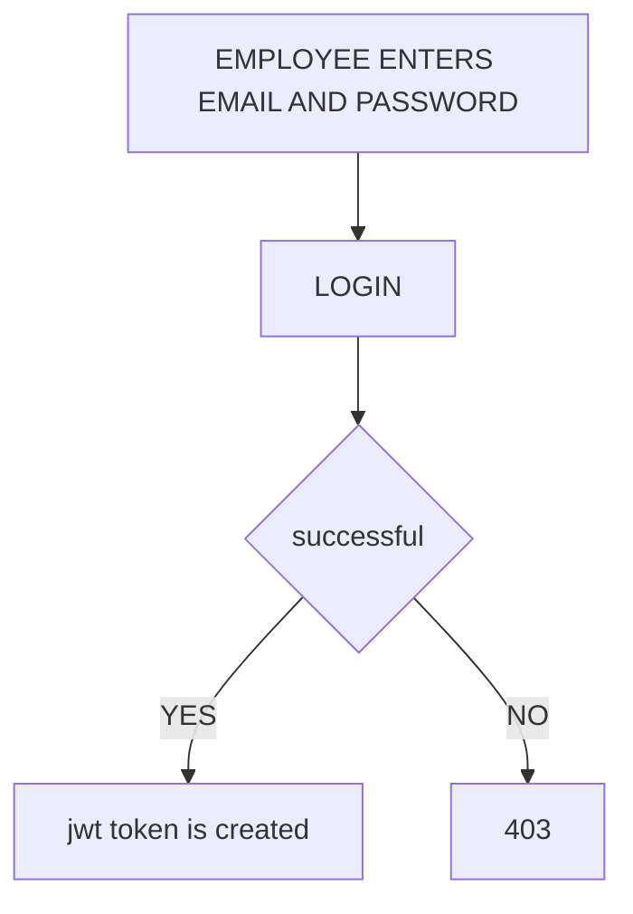
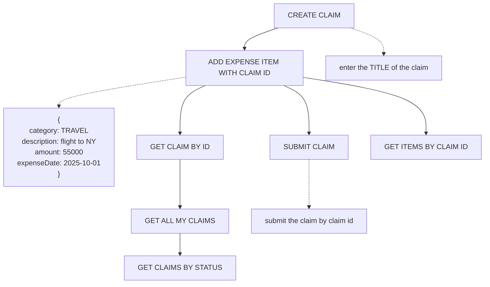
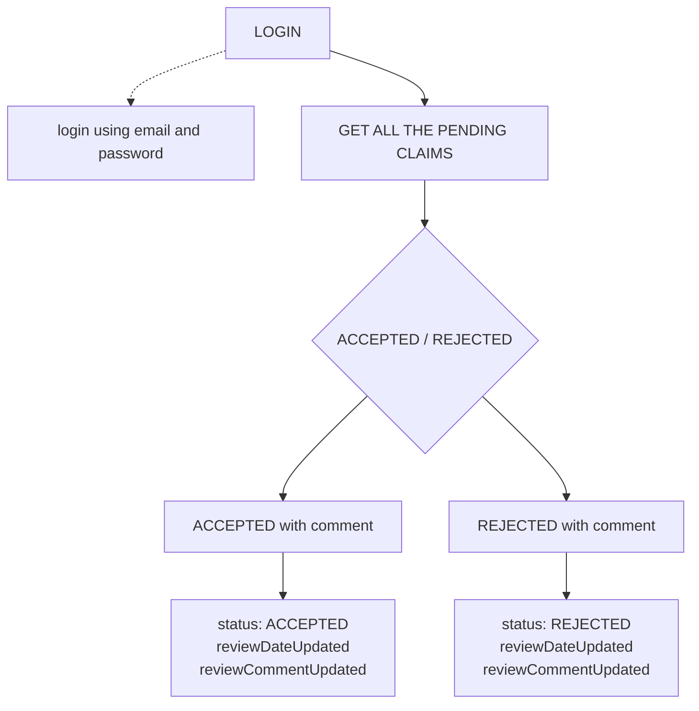
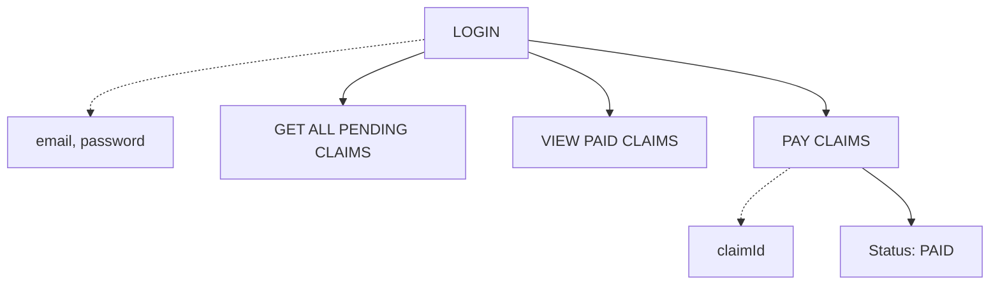

### WORKFLOWS

---

## LOGIN


---

## EMPLOYEE WORKFLOW

---

## MANAGER WORKFLOW



---
## FINANCE WORKFLOW



---

### logins sample

```json
employee

 {
   "email": "prasid.employee@claimx.com",
   "password": "prasid@123"
 }

 {
  "email": "prajwal.employee@claimx.com",
  "password": "prajwal@123"
}

---

manager

---

{
  "email": "venkat.manager@claimx.com",
  "password": "venkat@123"
}


{
  "email": "mohan.manager@claimx.com",
  "password": "mohan@123"
}

---

finance

---


{
  "email": "akash.finance@claimx.com",
  "password": "akash@123"
}

---

admin

---
{
  "email": "admin@claimx.com",
  "password": "admin@123"
}

```

